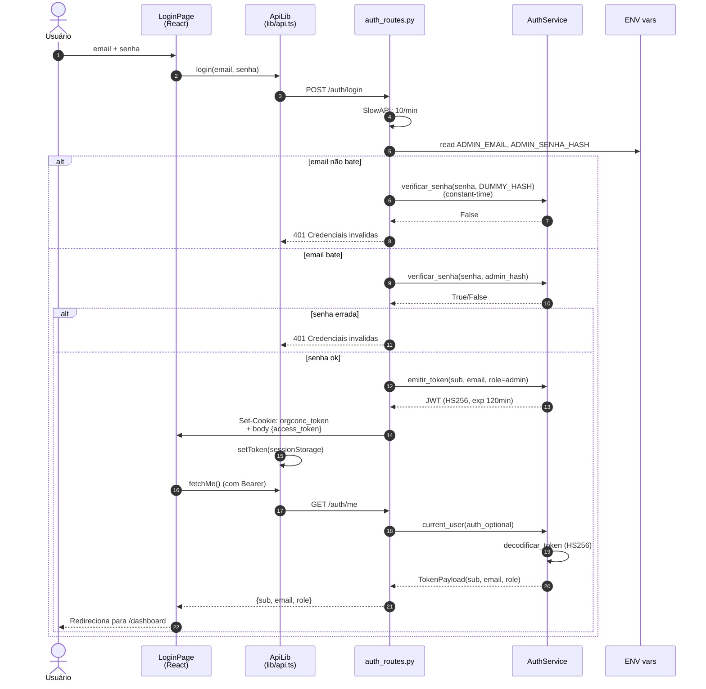
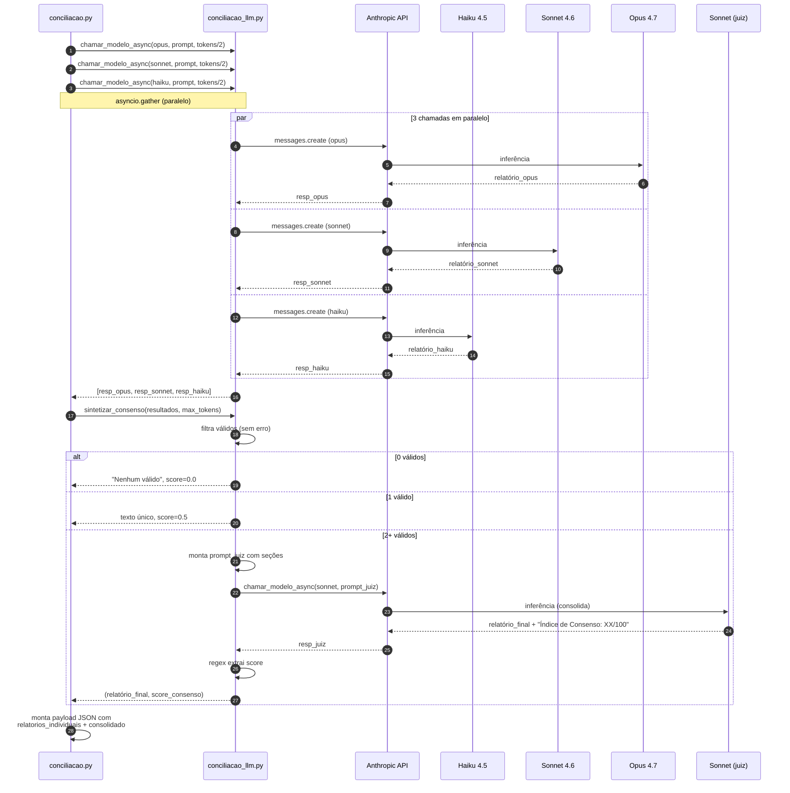
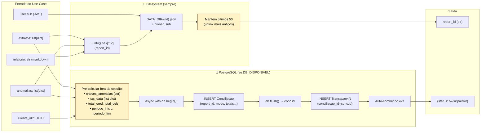
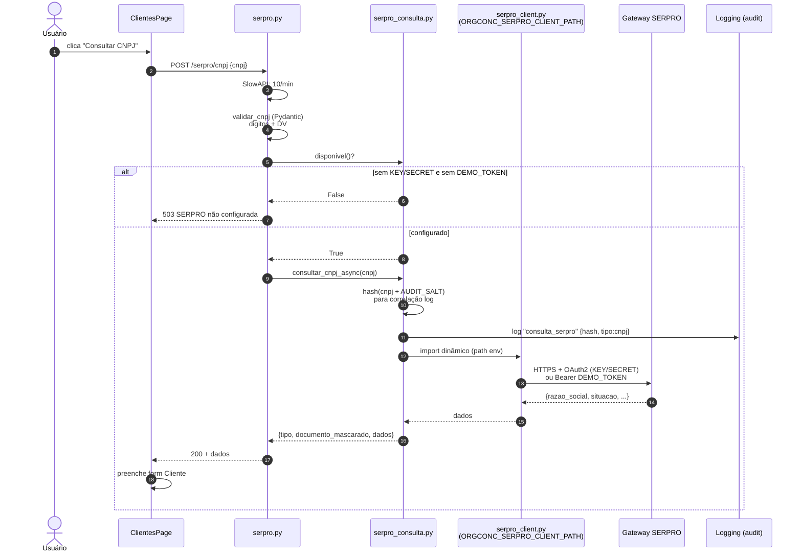
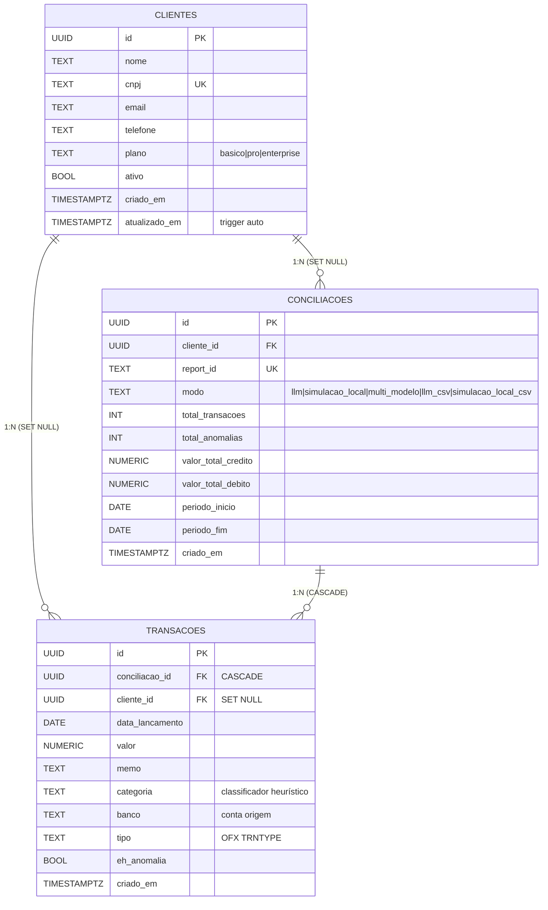
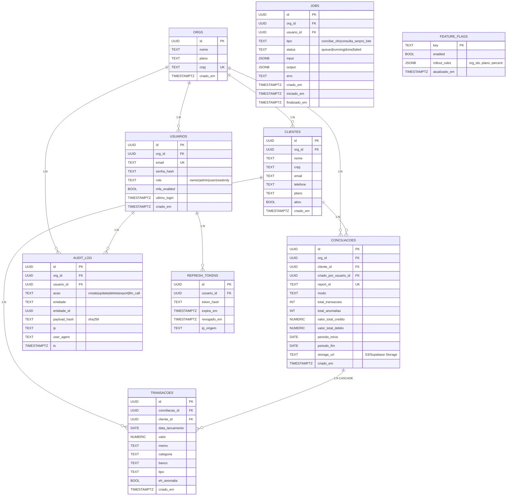
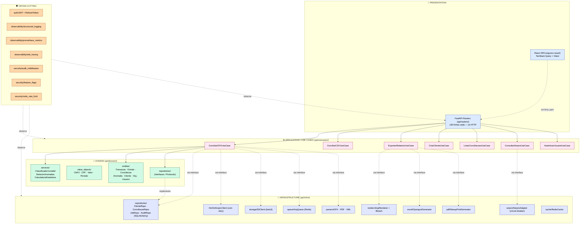
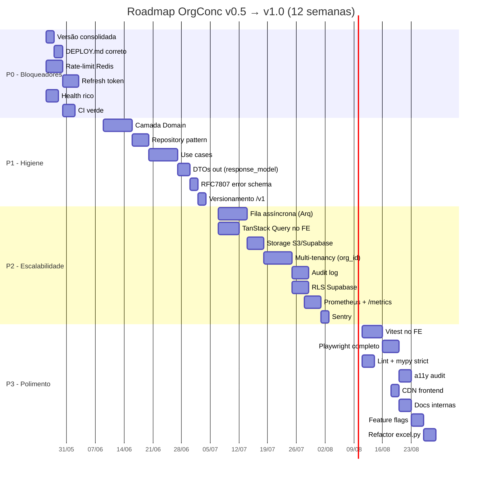

# OrgConc — Fluxograma Completo e Projeto de Implementação

> **Data:** 2026-05-25
> **Versão alvo:** `v1.0.0` (após conclusão deste roadmap)
> **Versão atual:** `v0.5.0`
> **Documento companheiro:** [`analise_camadas_arquitetura.md`](./analise_camadas_arquitetura.md)
> **Diagramas:** Mermaid (renderizáveis em GitHub, VS Code, Obsidian, mkdocs)

---

## Índice

1. [Fluxograma macro — todas as camadas](#1-fluxograma-macro)
2. [Fluxogramas por subsistema](#2-fluxogramas-por-subsistema)
   - 2.1 [Autenticação](#21-autenticação)
   - 2.2 [Conciliação OFX (caminho LLM)](#22-conciliação-ofx-caminho-llm)
   - 2.3 [Conciliação OFX (multi-modelo + consenso)](#23-conciliação-ofx-multi-modelo--consenso)
   - 2.4 [Persistência (storage local + DB)](#24-persistência-storage-local--db)
   - 2.5 [Exportação (HTML/XLSX/PDF)](#25-exportação-htmlxlsxpdf)
   - 2.6 [Consulta SERPRO](#26-consulta-serpro)
   - 2.7 [Cross-cutting (logging, rate-limit, security)](#27-cross-cutting)
3. [Modelo de dados (ER + classes)](#3-modelo-de-dados)
4. [Arquitetura alvo (após reorganização)](#4-arquitetura-alvo)
5. [Projeto de implementação — visão geral](#5-projeto-de-implementação--visão-geral)
6. [Detalhamento dos 28 itens](#6-detalhamento-dos-28-itens)
7. [Cronograma + dependências](#7-cronograma--dependências)
8. [Riscos, mitigações e plano B](#8-riscos-mitigações-e-plano-b)
9. [Checklist de Definition of Done](#9-checklist-de-definition-of-done)

---

## 1. Fluxograma Macro

Visão completa de todas as camadas, dependências externas e fluxo principal de dados.

```mermaid
flowchart TB
    %% ────── EXTERNAL ACTORS ──────
    subgraph EXT["🌐 Atores externos"]
        Contador["👤 Contador<br/>(usuário final)"]
        Admin["👤 Admin"]
        Anthropic["🤖 Anthropic API<br/>(Claude 4.6/4.7)"]
        Serpro["🏛️ SERPRO<br/>(CPF/CNPJ)"]
        Supabase[("🗄️ Supabase<br/>PostgreSQL")]
    end

    %% ────── PRESENTATION ──────
    subgraph PRES["📱 PRESENTATION LAYER"]
        direction LR
        subgraph FE["Frontend (orgconc-react)"]
            LoginPage["LoginPage"]
            Dashboard["DashboardPage"]
            ConcPage["ConciliacaoPage"]
            ClientesPage["ClientesPage"]
            RelatoriosPage["RelatoriosPage"]
            ConfigPage["ConfiguracoesPage"]
            ApiLib["lib/api.ts<br/>(fetch wrapper)"]
            AuthCtx["lib/auth.tsx<br/>(Context)"]
        end
        subgraph LEG["UI Legada"]
            StaticHTML["static/index.html<br/>(deprecated)"]
        end
    end

    %% ────── API GATEWAY ──────
    subgraph GW["🚪 API GATEWAY (FastAPI)"]
        direction TB
        Middleware["Middlewares:<br/>• RequestIdMiddleware<br/>• CORSMiddleware<br/>• SecurityHeadersMiddleware<br/>• SlowAPI rate-limit"]
        Routers["Routers:<br/>health · auth · clientes · serpro<br/>conciliacao · exports · conciliacoes_list"]
    end

    %% ────── APPLICATION (implícita hoje) ──────
    subgraph APP["⚙️ APPLICATION LAYER (hoje: inline nos routers)"]
        Orchestrate["Orquestração:<br/>parse → detectar → LLM → persist → render"]
    end

    %% ────── DOMAIN ──────
    subgraph DOM["🧠 DOMAIN LAYER (hoje: parsers/ misturado)"]
        Parsers["FileParsers:<br/>ofx · pdf · xml_parser"]
        Classifier["ClassificadorContabil<br/>(80+ regras heurísticas)"]
        Detector["DetectorAnomalias<br/>(duplicidade · valor alto<br/>· estorno · transf. sem par)"]
        Stats["StatsCalculator<br/>(top cats · contrapartes · diário)"]
    end

    %% ────── INFRASTRUCTURE ──────
    subgraph INFRA["🔧 INFRASTRUCTURE LAYER"]
        direction TB
        DBClient["SQLAlchemy AsyncEngine<br/>+ asyncpg + pooler"]
        StorageJSON["StorageJSON<br/>(DATA_DIR rolling 50)"]
        LLMClient["LLMClient<br/>(Anthropic SDK + timeout 90s)"]
        SerproClient["SerproClient<br/>(plug-in path)"]
        Render["RelatorioRenderer<br/>(Jinja2 + bleach)"]
        Excel["ExcelGenerator<br/>(openpyxl)"]
        PDFGen["PDFGenerator<br/>(weasyprint + SSRF guard)"]
        Auth["AuthService<br/>(JWT HS256 + bcrypt)"]
    end

    %% ────── CROSS-CUTTING ──────
    subgraph CC["🛡️ CROSS-CUTTING"]
        Logging["JSON Logging<br/>+ PII masking<br/>+ request_id"]
        RateLimit["SlowAPI Limiter<br/>(in-memory ⚠️)"]
        SecHeaders["CSP · HSTS · XFO<br/>· Referrer-Policy"]
        Config["Config + env validation"]
    end

    %% ────── CONNECTIONS ──────
    Contador --> LoginPage
    Contador --> Dashboard
    Contador --> ConcPage
    Contador --> ClientesPage
    Admin --> ConfigPage

    LoginPage --> ApiLib
    Dashboard --> ApiLib
    ConcPage --> ApiLib
    ClientesPage --> ApiLib
    RelatoriosPage --> ApiLib
    AuthCtx --> ApiLib

    ApiLib -.HTTPS+JWT.-> Middleware
    StaticHTML -.HTTPS.-> Middleware

    Middleware --> Routers
    Routers --> Orchestrate

    Orchestrate --> Parsers
    Orchestrate --> Detector
    Orchestrate --> Classifier
    Orchestrate --> Stats
    Orchestrate --> LLMClient
    Orchestrate --> StorageJSON
    Orchestrate --> DBClient
    Orchestrate --> Render
    Orchestrate --> Excel
    Orchestrate --> PDFGen
    Routers --> Auth
    Routers --> SerproClient

    LLMClient -.HTTPS.-> Anthropic
    SerproClient -.OAuth2/mTLS.-> Serpro
    DBClient -.asyncpg.-> Supabase

    Logging -.observa.-> Middleware
    Logging -.observa.-> Routers
    Logging -.observa.-> Orchestrate
    RateLimit -.protege.-> Routers
    SecHeaders -.aplica.-> Middleware
    Config -.injeta.-> GW
    Config -.injeta.-> INFRA

    classDef ext fill:#fef3c7,stroke:#92400e,color:#000
    classDef pres fill:#dbeafe,stroke:#1e40af,color:#000
    classDef gw fill:#e9d5ff,stroke:#6b21a8,color:#000
    classDef app fill:#fce7f3,stroke:#9f1239,color:#000
    classDef dom fill:#d1fae5,stroke:#065f46,color:#000
    classDef infra fill:#e0e7ff,stroke:#3730a3,color:#000
    classDef cc fill:#fed7aa,stroke:#9a3412,color:#000

    class Contador,Admin,Anthropic,Serpro,Supabase ext
    class LoginPage,Dashboard,ConcPage,ClientesPage,RelatoriosPage,ConfigPage,ApiLib,AuthCtx,StaticHTML pres
    class Middleware,Routers gw
    class Orchestrate app
    class Parsers,Classifier,Detector,Stats dom
    class DBClient,StorageJSON,LLMClient,SerproClient,Render,Excel,PDFGen,Auth infra
    class Logging,RateLimit,SecHeaders,Config cc
```



---

## 2. Fluxogramas por subsistema

### 2.1 Autenticação



### 2.2 Conciliação OFX (caminho LLM)

```mermaid
flowchart TB
    Start([POST /conciliar/ofx<br/>UploadFile×N + modelo]) --> Auth{current_user<br/>OK?}
    Auth -- 401 --> End401([401 Token obrigatório])
    Auth -- ok --> Validate{modelo válido?<br/>1≤N≤50?<br/>tokens 100-64k?}
    Validate -- 400 --> End400([400 Parâmetro inválido])
    Validate -- ok --> Loop["for each UploadFile"]

    Loop --> ReadLim["read_limited<br/>max 10MB/arquivo"]
    ReadLim --> CheckTotal{total ≤ 50MB?}
    CheckTotal -- 413 --> End413([413 Excede limite total])
    CheckTotal -- ok --> ParseFile["_parse_arquivo<br/>OFX/PDF/XML"]
    ParseFile --> CheckParse{parse ok?<br/>txs > 0?}
    CheckParse -- erro --> End400b([400 Falha parseando])
    CheckParse -- ok --> AppendExtrato["extratos_parsed.append"]
    AppendExtrato --> MoreFiles{mais arquivos?}
    MoreFiles -- sim --> Loop
    MoreFiles -- não --> Simular{simular=true?}

    Simular -- sim --> DetectAnom1["_detectar_anomalias"]
    DetectAnom1 --> LocalReport["_conciliacao_local<br/>markdown sem LLM"]
    LocalReport --> SaveJSON1["salvar_dataset<br/>(JSON DATA_DIR)"]
    SaveJSON1 --> SaveDB1["salvar_no_banco<br/>(async, fire-and-forget)"]
    SaveDB1 --> Render1["render_html"]
    Render1 --> Respond1([200 modo=simulacao_local])

    Simular -- não --> Multi{multi_modelo?}

    Multi -- não --> Single["chamar_modelo_async<br/>(sonnet/haiku/opus)<br/>timeout 90s"]
    Single --> CheckLLM{erro?}
    CheckLLM -- credit balance --> End502a([502 saldo Anthropic])
    CheckLLM -- timeout --> End502b([502 timeout])
    CheckLLM -- ok --> DetectAnom2["_detectar_anomalias"]
    DetectAnom2 --> SaveJSON2["salvar_dataset"]
    SaveJSON2 --> SaveDB2["salvar_no_banco"]
    SaveDB2 --> Render2["render_html"]
    Render2 --> Respond2([200 modo=claude_llm])

    Multi -- sim --> ParallelLLM["asyncio.gather:<br/>opus + sonnet + haiku<br/>(paralelo)"]
    ParallelLLM --> Consenso["sintetizar_consenso<br/>(juiz: sonnet)"]
    Consenso --> DetectAnom3["_detectar_anomalias"]
    DetectAnom3 --> SaveJSON3["salvar_dataset"]
    SaveJSON3 --> SaveDB3["salvar_no_banco"]
    SaveDB3 --> Render3["render_html"]
    Render3 --> Respond3([200 modo=multi_modelo<br/>+ score_consenso])

    classDef start fill:#10b981,stroke:#065f46,color:#fff
    classDef end fill:#3b82f6,stroke:#1e40af,color:#fff
    classDef err fill:#ef4444,stroke:#991b1b,color:#fff
    classDef llm fill:#a855f7,stroke:#6b21a8,color:#fff

    class Start start
    class Respond1,Respond2,Respond3 end
    class End401,End400,End400b,End413,End502a,End502b err
    class Single,ParallelLLM,Consenso llm
```

### 2.3 Conciliação OFX (multi-modelo + consenso)



### 2.4 Persistência (storage local + DB)



**Pontos importantes:**
- **Pre-cálculo** das transações é feito **fora** da sessão DB: garante atomicidade — se qualquer cálculo falhar, o banco não é tocado.
- `salvar_no_banco` **engole exceções** e retorna `{status:"error",...}`. O caller inclui no payload mas a resposta HTTP é 200.
- Rolling window de 50 datasets — se em produção houver muito acesso, os mais antigos perdem.

### 2.5 Exportação (HTML/XLSX/PDF)

```mermaid
flowchart TB
    Req([GET /export/{html,xlsx,pdf}/{rid}]) --> Auth{current_user OK?}
    Auth -- 401 --> E401([401])
    Auth -- ok --> Load["carregar_dataset(rid, verify_sub=user.sub)"]
    Load --> CheckRid{rid regex válido?}
    CheckRid -- não --> E400([400 ID inválido])
    CheckRid -- sim --> CheckPath{arquivo existe?}
    CheckPath -- não --> E404([404 Expirado])
    CheckPath -- sim --> CheckOwner{owner_sub == user.sub?}
    CheckOwner -- não --> E403([403 Acesso negado])
    CheckOwner -- sim --> Format{formato?}

    Format -- html --> RenderHTML["render_html(relatorio_md):<br/>markdown→HTML<br/>+ sanitize_html (bleach)<br/>+ Jinja relatorio.html"]
    RenderHTML --> RespHTML([200 text/html<br/>attachment])

    Format -- xlsx --> GenXLSX["_gerar_xlsx(extratos, anomalias):<br/>openpyxl multi-aba"]
    GenXLSX --> RespXLSX([200 spreadsheetml<br/>attachment])

    Format -- pdf --> RenderPDFHtml["render_pdf_html:<br/>md→HTML + sanitize<br/>+ Jinja relatorio_pdf.html<br/>+ totais agregados"]
    RenderPDFHtml --> CheckHTMLOnly{?html=true?}
    CheckHTMLOnly -- sim --> RespHTMLPdf([200 inline text/html])
    CheckHTMLOnly -- não --> Weasy["weasyprint.HTML.write_pdf<br/>+ url_fetcher=_block (anti-SSRF)"]
    Weasy --> CheckPDF{sucesso?}
    CheckPDF -- erro --> Fallback([200 inline text/html<br/>fallback])
    CheckPDF -- ok --> RespPDF([200 application/pdf<br/>attachment])

    classDef start fill:#10b981,stroke:#065f46,color:#fff
    classDef end fill:#3b82f6,stroke:#1e40af,color:#fff
    classDef err fill:#ef4444,stroke:#991b1b,color:#fff
    classDef sec fill:#f59e0b,stroke:#92400e,color:#000

    class Req start
    class RespHTML,RespXLSX,RespPDF,RespHTMLPdf,Fallback end
    class E400,E401,E403,E404 err
    class Weasy sec
```

### 2.6 Consulta SERPRO



### 2.7 Cross-cutting

```mermaid
flowchart LR
    Req["HTTP Request"] --> M1[RequestIdMiddleware]
    M1 --> GenRid["X-Request-ID:<br/>header ou uuid()[:16]"]
    GenRid --> SetCtx["request_id_var.set(rid)<br/>(ContextVar)"]
    SetCtx --> M2[CORSMiddleware]
    M2 --> M3[SecurityHeadersMiddleware]
    M3 --> Limiter[SlowAPI rate-limit]
    Limiter --> CheckRate{limite?}
    CheckRate -- excedido --> Rej([429 Too Many Requests])
    CheckRate -- ok --> Router[Router handler]
    Router --> Logic[Business logic]
    Logic --> Log["log.info / log.warning"]
    Log --> Format[JsonFormatter]
    Format --> Mask["mask_pii:<br/>CPF/CNPJ/email/IP"]
    Mask --> Emit["JSON line para stdout<br/>{ts, lvl, msg, request_id, ...}"]
    Logic --> Resp[Response]
    Resp --> AddHeaders["+CSP +HSTS +XFO +Referrer-Policy"]
    AddHeaders --> AddRid["+X-Request-ID header"]
    AddRid --> Client["HTTP Response"]
```



---

## 3. Modelo de Dados

### 3.1 ER atual (Cliente, Conciliacao, Transacao)



### 3.2 ER alvo (com multi-tenancy + auditoria)



---

## 4. Arquitetura alvo (após reorganização)



**Regras de dependência (importações):**
- `domain/` **NÃO importa** nada externo (sem FastAPI, sem SQLAlchemy, sem Anthropic).
- `usecases/` importa `domain/` + interfaces (Protocols) declaradas em `domain/repositories/`.
- `infra/` importa `domain/` (para implementar interfaces).
- `routers/` importa `usecases/` + Pydantic schemas (request/response).
- `main.py` faz wiring (DI): instancia infra → injeta em use cases → injeta em routers.

---

## 5. Projeto de implementação — visão geral

### 5.1 Fases (mapeadas para sprints de 2 semanas)



### 5.2 Resumo de esforço por item

Legenda: **XS** (≤4h), **S** (½ dia), **M** (1–2 dias), **L** (3–5 dias), **XL** (>5 dias).

| #  | Item                                       | Esf. | Prio | Dep. |
|----|--------------------------------------------|:----:|:----:|------|
|  1 | Consolidar versão                          |  XS  | P0   | —    |
|  2 | DEPLOY.md correto                          |  S   | P0   | 1    |
|  3 | Rate-limit Redis                           |  M   | P0   | —    |
|  4 | Refresh token                              |  M   | P0   | —    |
|  5 | Health check rico                          |  S   | P0   | —    |
|  6 | CI verde + lint check                      |  M   | P0   | —    |
|  7 | Camada de domínio                          |  L   | P1   | —    |
|  8 | Use cases explícitos                       |  L   | P1   | 7,9  |
|  9 | Repository pattern                         |  M   | P1   | 7    |
| 10 | DTOs de saída (response_model)             |  M   | P1   | 8    |
| 11 | RFC 7807 erro padronizado                  |  S   | P1   | —    |
| 12 | Versionamento /v1                          |  S   | P1   | 8    |
| 13 | Fila assíncrona LLM (Arq)                  |  L   | P2   | 8    |
| 14 | TanStack Query no frontend                 |  M   | P2   | 10   |
| 15 | Storage S3-compatible                      |  M   | P2   | 9    |
| 16 | Multi-tenancy (org_id)                     |  XL  | P2   | 9    |
| 17 | Audit log                                  |  M   | P2   | 16   |
| 18 | Métricas Prometheus                        |  M   | P2   | —    |
| 19 | Sentry / error tracking                    |  S   | P2   | —    |
| 20 | Testes unitários frontend (Vitest)         |  L   | P3   | 14   |
| 21 | E2E Playwright completo                    |  M   | P3   | —    |
| 22 | Lint + mypy strict                         |  M   | P3   | 7    |
| 23 | a11y audit                                 |  S   | P3   | 21   |
| 24 | CDN para frontend                          |  XS  | P3   | —    |
| 25 | Documentação interna (ARCH/RUNBOOK/SEC)    |  M   | P3   | tudo |
| 26 | Feature flags                              |  M   | P3   | 16   |
| 27 | Atualizar lucide-react                     |  XS  | P3   | —    |
| 28 | Refactor excel.py                          |  M   | P3   | 8    |

Total estimado: **~12 semanas** para 1 dev full-time, ou **~6 semanas** com 2 devs em paralelo (P0/P1 sequencial, P2/P3 paralelo).

---

## 6. Detalhamento dos 28 itens

> Para cada item: **Objetivo · Arquivos afetados · Passos · Critérios de aceitação · Testes**.

---

### 🔴 P0 — Bloqueadores

#### Item 1 — Consolidar versão

**Objetivo:** Versão única (SemVer) em todos os manifests. Hoje: README diz 0.4, `main.py` diz 0.5.0, DEPLOY.md cita 0.9.0.

**Arquivos afetados:**
- `api/main.py` (linha 115: `version="0.5.0"`)
- `api/routers/health.py` (linhas 21, 41)
- `README.md`
- `DEPLOY.md`
- `orgconc-react/package.json` (linha 4)
- Novo: `VERSION` (arquivo único, source of truth)

**Passos:**
1. Definir versão atual como `0.6.0` (próximo minor — vamos reorganizar).
2. Criar `VERSION` na raiz com `0.6.0`.
3. Em `api/core/config.py`, ler `VERSION` em vez de hardcoded:
   ```python
   VERSION = (ROOT_DIR / "VERSION").read_text().strip()
   ```
4. Substituir `"0.5.0"` em main.py/health.py por `from api.core.config import VERSION`.
5. Em `package.json`, atualizar `version: "0.6.0"`.
6. Atualizar README + DEPLOY com versão real.
7. Instalar `bump-my-version`: `pip install bump-my-version`. Configurar `.bumpversion.toml`.

**Critérios de aceitação:**
- [ ] `grep -r "0.5.0\|0.9.0\|version.*0\." . --include="*.{py,md,json}" -l` retorna apenas `VERSION` e arquivos esperados.
- [ ] `curl /health` retorna `versao == VERSION`.
- [ ] `npm version --workspaces` retorna mesma versão.

**Testes:** smoke test que carrega `VERSION` e compara com `/health`.

---

#### Item 2 — DEPLOY.md correto

**Objetivo:** Documento de deploy que reflete o código real.

**Arquivos afetados:** `DEPLOY.md`.

**Passos:**
1. Remover referências a `frontend/login.html`, `dashboard_trust.html`.
2. Remover `audit_log`, `anomalias` (não existem no schema atual).
3. Substituir bloco "Variáveis Obrigatórias" pela lista exata do `_validate_production_env` em `api/core/config.py`:
   - `ANTHROPIC_API_KEY`
   - `ORGCONC_JWT_SECRET` (≥32 chars)
   - `ORGCONC_ADMIN_EMAIL`
   - `ORGCONC_ADMIN_SENHA_HASH`
   - `ORGCONC_CORS_ORIGINS`
   - `DATABASE_URL`
   - `ORGCONC_SERPRO_AUDIT_SALT` (em prod)
4. Adicionar seção "URLs reais":
   - API: definida no PaaS (sem GitHub Pages para o backend).
   - React SPA: servida pela própria API em `/app/`.
5. Atualizar fluxo de build:
   ```bash
   cd orgconc-react && npm install && npm run build
   # → gera orgconc-react/dist (servido por StaticFiles em /app/)
   ```
6. Substituir o setup de Supabase pela referência direta ao `supabase/migrations/002_fix_uuid_types.sql` (idempotente).

**Critérios de aceitação:**
- [ ] Nenhum arquivo citado no DEPLOY existe apenas no DEPLOY.
- [ ] Toda env var em `_validate_production_env` está documentada.
- [ ] Onboarding de novo dev consegue subir o stack em <30 min seguindo só o DEPLOY.

**Testes:** revisão manual + checklist por outro dev.

---

#### Item 3 — Rate-limit distribuído (Redis)

**Objetivo:** Rate-limit consistente entre workers.

**Arquivos afetados:**
- `api/core/rate_limit.py`
- `requirements.txt` (+ `redis==5.x`)
- `docker-compose.yml` (serviço `redis`)
- `.env.example` (+ `REDIS_URL`)

**Passos:**
1. Adicionar `redis==5.0.7` em `requirements.txt`.
2. Adicionar serviço Redis em `docker-compose.yml`:
   ```yaml
   redis:
     image: redis:7-alpine
     ports: ["6379:6379"]
     restart: unless-stopped
   ```
3. Em `api/core/rate_limit.py`:
   ```python
   import os
   from slowapi import Limiter
   from slowapi.util import get_remote_address

   _REDIS_URL = os.environ.get("REDIS_URL", "")
   _storage_uri = _REDIS_URL or "memory://"

   limiter = Limiter(key_func=_get_rate_key, default_limits=["120/minute"], storage_uri=_storage_uri)
   ```
4. Em produção, `REDIS_URL` obrigatório → validar em `_validate_production_env`.

**Critérios de aceitação:**
- [ ] Subindo 2 workers uvicorn + 1 Redis, o limite é compartilhado (testar com `hey -n 200 -c 20`).
- [ ] Em dev, `REDIS_URL` vazio cai para memória sem erro.

**Testes:**
- Unit: simular subir 2 instâncias de `Limiter` apontando para mesma Redis e verificar share.
- Integração: docker-compose up + script que dispara 200 req em 1s e conta 429.

---

#### Item 4 — Refresh token

**Objetivo:** Sessão longa sem expor JWT permanente.

**Arquivos afetados:**
- `api/services/auth.py` (+ `emitir_refresh_token`, `validar_refresh_token`)
- `api/routers/auth_routes.py` (+ `POST /auth/refresh`)
- `api/db/models.py` (+ `RefreshToken`)
- Nova migration Alembic
- `orgconc-react/src/lib/auth.tsx` (+ refresh automático antes da expiração)

**Passos:**
1. Criar tabela `refresh_tokens(id UUID PK, usuario_id UUID, token_hash TEXT, expira_em TIMESTAMPTZ, revogado_em TIMESTAMPTZ NULL, ip TEXT, user_agent TEXT)`.
2. Em `/auth/login`, emitir:
   - access_token (curto: 15min) no body
   - refresh_token (longo: 30 dias) em cookie httpOnly+secure+samesite=strict
3. Endpoint `POST /auth/refresh`:
   - Lê cookie `orgconc_refresh`
   - Valida hash, expiração, revogação
   - **Rotaciona** (revoga o antigo, emite novo) — boa prática
   - Retorna novo access_token + novo cookie refresh
4. Endpoint `POST /auth/logout`: revoga refresh atual.
5. No frontend, agendar refresh quando access_token estiver a 1min de expirar.

**Critérios de aceitação:**
- [ ] Login retorna access_token + Set-Cookie refresh.
- [ ] Após 15min, frontend chama `/auth/refresh` automaticamente sem prompt.
- [ ] Refresh rotacionado: o antigo retorna 401 se reusado (anti-replay).
- [ ] Logout invalida tudo.

**Testes:**
- Unit: emitir, decodificar, expirar, revogar.
- E2E Playwright: login → esperar 16min → operação continua OK.

---

#### Item 5 — Health check rico

**Objetivo:** `/health` reporta saúde de todas as dependências.

**Arquivos afetados:** `api/routers/health.py`.

**Passos:**
1. Em vez de `{"status": "ok"}`, retornar:
   ```json
   {
     "status": "ok|degraded|down",
     "versao": "0.6.0",
     "uptime_s": 12345,
     "dependencies": {
       "database": {"status":"ok","latency_ms":12},
       "anthropic": {"status":"ok","latency_ms":42},
       "serpro": {"status":"ok"},
       "redis": {"status":"ok","latency_ms":1},
       "disk_data_dir": {"status":"ok","free_mb":52000}
     }
   }
   ```
2. Cada check com timeout próprio (3s) para não bloquear.
3. Exposição opcional via flag `?details=true` (sem flag retorna resumo).
4. Endpoint separado `/health/live` (liveness K8s, retorna sempre 200) vs `/health/ready` (readiness, valida deps).

**Critérios de aceitação:**
- [ ] `/health` < 500ms mesmo com 1 dep lenta (graças aos timeouts).
- [ ] Status agregado é `degraded` se alguma dep estiver `down` mas o core (DB) OK.

**Testes:**
- Unit: mockar cada dep retornando ok/timeout/erro.
- Integração: subir stack completo, verificar `/health` reporta ok.

---

#### Item 6 — CI verde

**Objetivo:** Pipeline GitHub Actions rodando em cada PR.

**Arquivos afetados:** `.github/workflows/ci.yml` (criar ou ajustar).

**Passos:**
1. Workflow `ci.yml` com 3 jobs:
   - `backend`: setup python 3.12 → `pip install -r requirements-dev.txt` → `ruff check` → `pytest --cov`
   - `frontend`: setup node 20 → `npm ci` → `npm run typecheck` → `npm run lint` → `npm run build`
   - `e2e`: needs [backend, frontend] → `playwright test`
2. Branch protection: PR só mergeable com CI verde.
3. Cache: pip e node_modules para acelerar.

**Critérios de aceitação:**
- [ ] PR de teste passa em < 5min.
- [ ] Falha de teste bloqueia merge.

**Testes:** auto-validação no próprio PR.

---

### 🟠 P1 — Higiene arquitetural

#### Item 7 — Camada de Domínio

**Objetivo:** Tornar domínio explícito, tipado e puro.

**Arquivos novos:**
```
api/domain/
├── __init__.py
├── entities.py          # Transacao, Extrato, Anomalia, Conciliacao, Cliente
├── value_objects.py     # CNPJ, CPF, Valor, Periodo
├── services.py          # ClassificadorContabil, DetectorAnomalias
├── repositories.py      # Protocols (interfaces)
└── exceptions.py        # DomainError, RegraViolada, etc.
```

**Passos:**
1. Definir entidades como `@dataclass(frozen=True)`:
   ```python
   from dataclasses import dataclass
   from datetime import date
   from decimal import Decimal

   @dataclass(frozen=True)
   class Transacao:
       conta: str
       data: date
       valor: Decimal
       memo: str
       nome: str
       tipo: str
       checknum: str | None = None
   ```
2. Value Objects:
   ```python
   @dataclass(frozen=True)
   class CNPJ:
       digitos: str

       def __post_init__(self):
           # validação aqui (DV)
           ...
   ```
3. Mover `DetectorAnomalias` e `ClassificadorContabil` para `domain/services.py`. Manter `parsers/__init__.py` re-exportando para retrocompat (sem quebrar imports atuais).
4. Definir `Protocols` em `domain/repositories.py`:
   ```python
   from typing import Protocol

   class ClienteRepository(Protocol):
       async def criar(self, cliente: Cliente) -> Cliente: ...
       async def buscar_por_id(self, id: UUID) -> Cliente | None: ...
       ...
   ```
5. Domínio **não importa** FastAPI/SQLAlchemy/anthropic. Lint regra com `import-linter`.

**Critérios de aceitação:**
- [ ] `api/domain/` zero imports de pacotes de infraestrutura.
- [ ] `mypy --strict api/domain` zero erros.
- [ ] Cobertura domínio ≥ 95%.

**Testes:** unitários puros (sem fixture de DB/HTTP) cobrindo cada entidade, VO e service.

---

#### Item 8 — Use cases

**Objetivo:** Cada operação de negócio = 1 classe com `execute()`.

**Arquivos novos:**
```
api/usecases/
├── __init__.py
├── base.py              # UseCase[Input, Output] abstrato
├── conciliar_ofx.py     # ConciliarOFXUseCase
├── conciliar_csv.py
├── exportar_relatorio.py
├── criar_cliente.py
├── listar_conciliacoes.py
├── consultar_serpro.py
└── autenticar.py
```

**Exemplo:**
```python
# api/usecases/conciliar_ofx.py
from dataclasses import dataclass
from api.domain.entities import Extrato, Anomalia
from api.domain.services import DetectorAnomalias
from api.domain.repositories import ConciliacaoRepository, JobRepository

@dataclass
class ConciliarOFXInput:
    arquivos: list[bytes]
    nomes: list[str]
    modo: str  # "simulacao" | "haiku" | "sonnet" | "opus" | "multi"
    max_tokens: int
    cliente_id: UUID | None
    user_sub: str
    org_id: UUID

@dataclass
class ConciliarOFXOutput:
    report_id: str
    extratos: list[dict]
    anomalias: list[Anomalia]
    relatorio_md: str

class ConciliarOFXUseCase:
    def __init__(
        self,
        parsers: FileParserRegistry,
        detector: DetectorAnomalias,
        llm: LLMClient,
        storage: StorageGateway,
        repo: ConciliacaoRepository,
    ):
        self.parsers = parsers
        self.detector = detector
        self.llm = llm
        self.storage = storage
        self.repo = repo

    async def execute(self, input: ConciliarOFXInput) -> ConciliarOFXOutput:
        # 1. parse
        extratos = [self.parsers.parse(arq, nome) for arq, nome in zip(input.arquivos, input.nomes)]
        # 2. detectar
        anomalias = self.detector.analisar(extratos)
        # 3. LLM (ou simulacao)
        relatorio = ... if input.modo == "simulacao" else await self.llm.gerar(...)
        # 4. persist
        rid = self.storage.salvar_dataset(extratos, anomalias, relatorio, owner_sub=input.user_sub)
        await self.repo.salvar(rid, extratos, anomalias, input.modo, input.cliente_id, input.org_id)
        # 5. output (DTO)
        return ConciliarOFXOutput(report_id=rid, extratos=extratos, anomalias=anomalias, relatorio_md=relatorio)
```

**Routers viram:**
```python
@router.post("/conciliar/ofx", response_model=ConciliarOFXResponseModel)
async def conciliar_ofx(
    request: Request,
    arquivos: list[UploadFile] = File(...),
    modo: str = "sonnet",
    user: TokenPayload = Depends(current_user),
    use_case: ConciliarOFXUseCase = Depends(get_conciliar_ofx_uc),
):
    arquivos_bytes = [await a.read() for a in arquivos]
    input = ConciliarOFXInput(arquivos=arquivos_bytes, ..., user_sub=user.sub)
    out = await use_case.execute(input)
    return ConciliarOFXResponseModel.from_output(out)
```

**Passos:**
1. Criar `usecases/base.py` com `Protocol UseCase[I, O]: execute(i: I) -> O`.
2. Migrar 1 use case por vez (começar pelo mais simples: `CriarClienteUseCase`).
3. Setup de DI em `api/main.py` ou módulo dedicado `api/wiring.py` (factories que injetam infra→usecase→router).

**Critérios de aceitação:**
- [ ] Nenhum router em `api/routers/` excede 30 linhas.
- [ ] Cada use case tem teste unitário (mockando interfaces).
- [ ] Cobertura `api/usecases/` ≥ 90%.

---

#### Item 9 — Repository pattern

**Objetivo:** Acesso ao DB via interfaces injetáveis.

**Arquivos:**
- `api/domain/repositories.py` (Protocols)
- `api/infra/repositories/clientes.py` (impl SQLAlchemy)
- `api/infra/repositories/conciliacoes.py`
- (depois) `api/infra/repositories/jobs.py`, `auditlog.py`

**Passos:**
1. Mover `api/db/clientes.py` → `api/infra/repositories/clientes.py`, transformando em classe:
   ```python
   class ClienteRepositorySQL(ClienteRepository):
       def __init__(self, session: AsyncSession): ...
       async def criar(self, cliente: Cliente) -> Cliente: ...
   ```
2. Conversor entity ↔ ORM no repo (mapeamento manual ou via dataclass copy).
3. Em `wiring.py`, factory:
   ```python
   async def get_cliente_repo() -> ClienteRepository:
       async with SessionLocal() as s:
           yield ClienteRepositorySQL(s)
   ```
4. Use case recebe `ClienteRepository` (interface) — não conhece SQLAlchemy.

**Critérios de aceitação:**
- [ ] Use case testável trocando repo por `InMemoryClienteRepository`.
- [ ] Nenhum import de `sqlalchemy` em `usecases/`.

---

#### Item 10 — DTOs de saída (`response_model`)

**Objetivo:** Schemas explícitos para Swagger e clientes tipados.

**Arquivos:**
- `api/routers/*.py` (cada endpoint ganha `response_model=`)
- `api/schemas.py` ou novos `api/schemas/responses/`

**Passos:**
1. Para cada endpoint, criar Pydantic Response:
   ```python
   class ConciliarOFXResponse(BaseModel):
       modo: str
       report_id: str
       extratos: list[ExtratoResumo]
       anomalias: list[AnomaliaResponse]
       relatorio_md: str
       relatorio_html: str | None = None
       usage: TokenUsage | None = None
       persistencia: PersistenciaStatus
   ```
2. Anotar:
   ```python
   @router.post("/conciliar/ofx", response_model=ConciliarOFXResponse)
   ```
3. Swagger ganha schema correto; cliente OpenAPI gerado (FE pode usar `openapi-typescript`).

**Critérios de aceitação:**
- [ ] Todos os endpoints REST com `response_model` ou `status_code` definido.
- [ ] Schema Swagger não tem mais "additionalProperties: true" não-intencional.

---

#### Item 11 — RFC 7807 (Problem Details)

**Objetivo:** Erros padronizados.

**Arquivos:**
- `api/core/exception_handlers.py` (novo)
- `api/main.py` (registra handlers)

**Passos:**
1. Definir handler:
   ```python
   from fastapi.responses import JSONResponse
   from starlette.exceptions import HTTPException

   async def problem_details_handler(request, exc: HTTPException):
       return JSONResponse(
           status_code=exc.status_code,
           media_type="application/problem+json",
           content={
               "type": f"https://orgconc.app/errors/{exc.status_code}",
               "title": exc.detail if isinstance(exc.detail, str) else "Erro",
               "status": exc.status_code,
               "detail": exc.detail if isinstance(exc.detail, dict) else None,
               "instance": request.url.path,
               "request_id": request.headers.get("X-Request-ID", "-"),
           },
       )
   ```
2. Em `main.py`:
   ```python
   app.add_exception_handler(HTTPException, problem_details_handler)
   app.add_exception_handler(RequestValidationError, validation_problem_handler)
   ```

**Critérios:**
- [ ] Toda resposta de erro segue RFC 7807.
- [ ] Inclui `request_id` para correlação com logs.

---

#### Item 12 — Versionamento `/v1`

**Objetivo:** Permitir evolução incompatível sem quebrar clientes.

**Passos:**
1. Adicionar prefixo `/v1` em todos os routers de negócio (exceto `/health`, `/auth`):
   ```python
   app.include_router(clientes.router, prefix="/v1")
   ```
2. Rota legada responde 308:
   ```python
   @app.get("/clientes/{rest:path}")
   def legacy_clientes_get(rest: str):
       return RedirectResponse(f"/v1/clientes/{rest}", status_code=308)
   ```
3. Atualizar `orgconc-react/src/lib/api.ts` para usar `/v1/...`.
4. Documentar política de versionamento em `docs/API_VERSIONING.md`.

**Critérios:**
- [ ] Todos os clientes (FE, scripts) usam `/v1`.
- [ ] Rota legada por 1 release retorna 308.

---

### 🟡 P2 — Escalabilidade

#### Item 13 — Fila assíncrona (Arq)

**Objetivo:** LLM em background, request HTTP retorna em <500ms.

**Arquivos:**
- `api/infra/queue/arq_queue.py` (cliente Arq)
- `api/workers/conciliacao_worker.py` (functions)
- `api/routers/jobs.py` (novo: `/v1/jobs/{id}`)
- `api/db/models.py` (+ `Job`)
- `docker-compose.yml` (worker arq)

**Passos:**
1. `pip install arq`. Configurar `ArqWorker` apontando para Redis.
2. Modificar `ConciliarOFXUseCase.execute_async`:
   - Salva input no `Job(status=queued, input=...)`.
   - Enqueue: `await arq_pool.enqueue_job('conciliar_ofx_task', job_id=job.id)`.
   - Retorna 202 + `job_id`.
3. Worker:
   ```python
   async def conciliar_ofx_task(ctx, job_id: UUID):
       job = await job_repo.get(job_id)
       job.status = "running"
       await job_repo.update(job)
       try:
           input = ConciliarOFXInput(**job.input)
           output = await conciliar_uc.execute(input)
           job.output = output.dict()
           job.status = "done"
       except Exception as e:
           job.status = "failed"; job.erro = str(e)
       await job_repo.update(job)
   ```
4. Endpoint polling:
   ```python
   GET /v1/jobs/{id} → {status, progresso, output?, erro?}
   ```
5. Frontend usa polling 2s ou SSE/WebSocket.

**Critérios:**
- [ ] `POST /v1/conciliar/ofx` retorna 202 em < 500ms.
- [ ] Worker processa em background sem bloquear HTTP.
- [ ] Frontend exibe spinner + polling até `status==done`.

---

#### Item 14 — TanStack Query

**Objetivo:** Cache, revalidação, mutations padronizados no FE.

**Arquivos:** todas as pages que fazem `fetch` direto.

**Passos:**
1. `npm install @tanstack/react-query`.
2. Wrappear App em `<QueryClientProvider>`.
3. Substituir `useEffect(() => fetch(...))` por:
   ```typescript
   const { data, isLoading, error } = useQuery({
     queryKey: ['clientes'],
     queryFn: listarClientes,
     staleTime: 30_000,
   });
   ```
4. Mutations:
   ```typescript
   const mut = useMutation({
     mutationFn: criarCliente,
     onSuccess: () => qc.invalidateQueries({ queryKey: ['clientes'] }),
   });
   ```
5. Instalar devtools (`@tanstack/react-query-devtools`).

**Critérios:**
- [ ] Nenhum `useEffect + fetch` direto em pages.
- [ ] Navegar voltar para uma page já visitada não dispara nova requisição.

---

#### Item 15 — Storage S3-compatible

**Objetivo:** Datasets persistentes além do FS local.

**Passos:**
1. `pip install boto3`.
2. Criar `api/infra/storage/s3_storage.py`:
   ```python
   class S3StorageGateway(StorageGateway):
       def __init__(self, bucket: str, client: boto3.client): ...
       def salvar_dataset(self, ...) -> str: ...
       def carregar_dataset(self, rid: str) -> dict: ...
   ```
3. Configurar Supabase Storage bucket `orgconc-datasets`.
4. Env: `ORGCONC_STORAGE_BACKEND=local|s3`, `S3_ENDPOINT_URL`, `S3_BUCKET`, `S3_KEY`, `S3_SECRET`.
5. Factory escolhe backend:
   ```python
   def get_storage() -> StorageGateway:
       return S3StorageGateway(...) if config.STORAGE_BACKEND == "s3" else LocalStorageGateway(...)
   ```

**Critérios:**
- [ ] Em produção (`STORAGE_BACKEND=s3`), datasets persistem após redeploy.
- [ ] Em dev, fallback para local.

---

#### Item 16 — Multi-tenancy (`org_id`)

**Objetivo:** Cada dado pertence a uma organização.

**Migration (Alembic):**
1. Criar tabela `orgs`.
2. `ALTER TABLE clientes ADD COLUMN org_id UUID NULL REFERENCES orgs(id)`.
3. Backfill: criar org default, atribuir tudo a ela.
4. `ALTER TABLE clientes ALTER COLUMN org_id SET NOT NULL`.
5. Repetir para `conciliacoes`, `transacoes`.

**Código:**
1. Adicionar `org_id` em entidades de domínio.
2. Repositories filtram por `org_id` automaticamente (recebem no construtor ou via context).
3. JWT inclui `org_id`. Dependency `current_org` extrai e injeta.
4. Use cases recebem `org_id` no input.

**Critérios:**
- [ ] Usuário da org A não enxerga dados da org B (testar com 2 contas).
- [ ] Migration roda em prod sem downtime (multi-step).

---

#### Item 17 — Audit log

**Objetivo:** Rastreabilidade de mutações.

**Arquivos:**
- `api/db/models.py` (+ `AuditLog`)
- `api/infra/repositories/audit.py`
- `api/middleware/audit_middleware.py`

**Passos:**
1. Tabela `audit_log` (ver ER alvo).
2. Middleware FastAPI que intercepta POST/PATCH/DELETE/PUT:
   ```python
   class AuditMiddleware(BaseHTTPMiddleware):
       async def dispatch(self, request, call_next):
           response = await call_next(request)
           if request.method in ('POST', 'PATCH', 'PUT', 'DELETE') and 200 <= response.status_code < 300:
               # hash do body, extrai usuario, org, salva
               ...
           return response
   ```
3. Endpoint `/v1/audit?org=...&from=...&to=...` (admin only).

**Critérios:**
- [ ] Cada mutação gera uma linha.
- [ ] `payload_hash` permite verificar integridade sem armazenar PII.

---

#### Item 18 — Métricas Prometheus

**Objetivo:** Observabilidade quantitativa.

**Arquivos:**
- `api/observability/metrics.py`
- `api/main.py` (mount `/metrics`)

**Passos:**
1. `pip install prometheus_client`.
2. Definir métricas:
   ```python
   from prometheus_client import Counter, Histogram, Gauge

   http_requests = Counter('orgconc_http_requests_total', '...', ['method', 'route', 'status'])
   llm_seconds = Histogram('orgconc_llm_call_seconds', '...', ['modelo'])
   conciliacao_total = Counter('orgconc_conciliacao_total', '...', ['modo', 'status'])
   db_pool_size = Gauge('orgconc_db_pool_size', '...')
   ```
3. Middleware incrementa http_requests.
4. `LLMClient.chamar_modelo_async` observa latency via `with llm_seconds.labels(modelo=...).time()`.
5. Endpoint:
   ```python
   from prometheus_client import generate_latest, CONTENT_TYPE_LATEST

   @app.get("/metrics", include_in_schema=False)
   def metrics():
       return Response(generate_latest(), media_type=CONTENT_TYPE_LATEST)
   ```
6. Configurar scrape no Grafana Cloud / Prometheus auto-hospedado.

**Critérios:**
- [ ] `/metrics` retorna formato Prometheus válido.
- [ ] Dashboard Grafana mostra QPS, P95 latência, taxa de erro LLM.

---

#### Item 19 — Sentry

**Objetivo:** Capturar exceções não tratadas.

**Passos:**
1. `pip install sentry-sdk`.
2. `main.py`:
   ```python
   sentry_sdk.init(
     dsn=os.environ['SENTRY_DSN'],
     environment=os.environ.get('ORGCONC_ENV', 'development'),
     traces_sample_rate=0.1,
     send_default_pii=False,
     before_send=lambda event, hint: mask_pii_in_event(event),
   )
   ```
3. Integrar com PII masking existente.
4. Frontend: `npm install @sentry/react`, configurar similarmente.

**Critérios:**
- [ ] Exceção em prod aparece no Sentry sem PII.
- [ ] Source maps subidos para stacktrace legível.

---

### 🟢 P3 — Polimento

#### Item 20 — Vitest no frontend

**Passos:**
1. `npm install -D vitest @testing-library/react @testing-library/jest-dom jsdom`.
2. `vite.config.ts`: `test: { environment: 'jsdom', setupFiles: ['./src/test-setup.ts'] }`.
3. Tests inicialmente: `lib/api.ts`, `lib/auth.tsx`, hooks customizados.
4. Pages: smoke tests (renderiza sem crash) + interação chave.

**Critérios:**
- [ ] `npm test` roda em CI.
- [ ] Cobertura ≥ 80% em `lib/`.

---

#### Item 21 — E2E Playwright completo

**Specs alvo:**
- `auth.spec.ts` — login/logout/refresh
- `conciliacao_ofx.spec.ts` — upload, simulacao, ver relatório
- `conciliacao_llm.spec.ts` — modo sonnet (mock backend)
- `exportacao.spec.ts` — baixar XLSX, PDF
- `clientes_crud.spec.ts` — criar/editar/listar/desativar
- `errors.spec.ts` — 401, 413, 429
- `acessibilidade.spec.ts` — axe-core em cada page

---

#### Item 22 — Lint + mypy strict

**Passos:**
1. Adicionar `requirements-dev.txt`:
   ```
   ruff==0.6.x
   mypy==1.11.x
   pre-commit==4.x
   ```
2. `pyproject.toml`:
   ```toml
   [tool.ruff]
   target-version = "py312"
   line-length = 100
   select = ["E","F","I","B","UP","S","SIM","RUF"]
   ignore = ["E501"]
   [tool.mypy]
   strict = true
   files = ["api/domain", "api/usecases"]
   ```
3. `.pre-commit-config.yaml` com ruff, mypy, prettier (FE).
4. CI roda `ruff check && mypy api/domain api/usecases`.

---

#### Item 23 — a11y audit

**Passos:**
1. `npm install -D @axe-core/playwright`.
2. Cada spec roda `await injectAxe(page); await checkA11y(page)`.
3. Meta WCAG 2.1 AA — `serious` e `critical` quebram build.

---

#### Item 24 — CDN para frontend

**Passos:**
1. Configurar Cloudflare em frente ao domínio.
2. Cache headers para `/app/assets/*` (immutable, max-age=31536000).
3. Purge no deploy via Cloudflare API.

---

#### Item 25 — Documentação interna

**Estrutura:**
```
docs/
├── ARCHITECTURE.md       # Camadas, decisões, ADRs
├── RUNBOOK.md            # Como debugar prod, plano rollback, incidentes
├── SECURITY.md           # Threat model, vetores cobertos, contato
├── ONBOARDING.md         # Setup dev em 30min
├── API_VERSIONING.md
├── ADRs/                 # Architecture Decision Records
│   ├── 001-clean-arch.md
│   ├── 002-arq-queue.md
│   └── ...
```

---

#### Item 26 — Feature flags

**Passos:**
1. Tabela `feature_flags(key TEXT PK, enabled BOOL, rollout JSONB)`.
2. Service:
   ```python
   class FeatureFlags:
       async def is_enabled(self, key: str, context: dict) -> bool: ...
   ```
3. Uso:
   ```python
   if await ff.is_enabled('conciliacao_multi_modelo', {'org_id': org.id, 'plano': org.plano}):
       ...
   ```
4. Admin UI para toggle (em ConfiguracoesPage, role admin).

---

#### Item 27 — Atualizar lucide-react

**Passos:**
1. `npm view lucide-react versions --json | tail -10` — confirmar última.
2. `npm install lucide-react@latest`.
3. `npm run typecheck` — corrigir imports renomeados.

---

#### Item 28 — Refactor `excel.py`

**Passos:**
1. Ler `api/services/excel.py` (18 KB) — identificar responsabilidades.
2. Quebrar em:
   ```
   api/infra/excel/
   ├── __init__.py            # ExcelGenerator (entrada)
   ├── workbook_builder.py    # criação Workbook, estilos globais
   ├── aba_extratos.py
   ├── aba_anomalias.py
   ├── aba_resumo.py
   └── styles.py              # fontes, fills, borders reutilizáveis
   ```
3. Cada submodule testável isoladamente.

---

## 7. Cronograma + dependências

```mermaid
graph LR
    P0[P0 Done<br/>S2] --> P1A[Domínio]
    P1A --> P1B[Repos]
    P1B --> P1C[Use Cases]
    P1C --> P1D[DTOs]
    P1D --> P1E[/v1]
    P1E --> P1F[RFC7807]

    P0 --> P2A[Fila Arq]
    P1C --> P2A

    P0 --> P2B[TanStack]
    P1D --> P2B

    P1B --> P2C[S3]
    P1B --> P2D[Multi-tenancy]
    P2D --> P2E[Audit log]
    P2D --> P2F[RLS]

    P0 --> P2G[Prometheus]
    P0 --> P2H[Sentry]

    P2B --> P3A[Vitest]
    P2A --> P3B[Playwright]
    P1A --> P3C[Lint+mypy]
    P3B --> P3D[a11y]

    classDef p0 fill:#ef4444,color:#fff
    classDef p1 fill:#f59e0b,color:#000
    classDef p2 fill:#fbbf24,color:#000
    classDef p3 fill:#10b981,color:#fff

    class P0 p0
    class P1A,P1B,P1C,P1D,P1E,P1F p1
    class P2A,P2B,P2C,P2D,P2E,P2F,P2G,P2H p2
    class P3A,P3B,P3C,P3D p3
```

---

## 8. Riscos, mitigações e plano B

| Risco | Probabilidade | Impacto | Mitigação | Plano B |
|-------|:------------:|:-------:|-----------|---------|
| Migração para Clean Arch trava feature delivery | Média | Alto | Migrar 1 contexto por vez (começar Conciliação); manter rest. estável | Reverter para arquitetura atual mantendo só Repository |
| Arq+Redis quebra deploy Render | Baixa | Médio | Manter fallback `BackgroundTasks` do FastAPI; toggle por env | Adiar fila para próxima release |
| RLS Supabase esconde dados legítimos | Média | Alto | Coverage 100% das policies + staging com dados reais | Disable RLS temporariamente + WAF |
| Multi-tenancy retro quebra dados existentes | Baixa | Crítico | Migration multi-step com backfill testado em staging | Restore do backup pré-migration |
| LLM latência aumenta após Sentry/OTel | Baixa | Médio | Sample rate baixo (10%), span só em pontos críticos | Disable spans LLM |
| Frontend grande quebra TanStack Query mid-flight | Baixa | Baixo | Migrar page por page atrás de flag | Reverter para fetch+useEffect |
| `lucide-react` upgrade quebra ícones renomeados | Alta | Baixo | Snapshot de cada page antes do upgrade | Pin versão anterior |
| Schema RFC 7807 quebra cliente externo | Baixa | Médio | Manter compat: detalha em `detail` mantendo formato antigo | Toggle por header `Accept` |

---

## 9. Definition of Done — checklist agregado

### Por release

- [ ] `VERSION` consistente em todos os manifests
- [ ] CI verde (backend + frontend + E2E)
- [ ] Cobertura ≥ 90% `api/domain` + `api/usecases`
- [ ] Cobertura ≥ 80% `orgconc-react/src`
- [ ] `mypy --strict` zero erros (domain + usecases)
- [ ] `ruff check` zero erros
- [ ] Sem regressão visual nas 6 pages (Playwright + screenshots)
- [ ] Documentação atualizada (`DEPLOY.md`, `RUNBOOK.md`, OpenAPI Swagger)
- [ ] Migrations Alembic + Supabase versionadas e testadas em staging
- [ ] Sem segredo em código (`gitleaks` no CI)

### Por feature (template)

- [ ] Code review por outro dev
- [ ] Teste unitário (positivo + negativo + edge)
- [ ] Teste integração (use case)
- [ ] E2E Playwright cobrindo fluxo principal
- [ ] Documentado em CHANGELOG.md
- [ ] Telemetria (log estruturado, métrica, span Sentry)
- [ ] Performance: P95 dentro do SLO definido
- [ ] Segurança: auth, validação input, sanitize output, audit log
- [ ] Acessibilidade: a11y check passa
- [ ] Idempotência se aplicável

### Produção pronta

- [ ] Deploy automatizado (push main → staging → manual approve → prod)
- [ ] Rollback automático se health degrada em 5min pós-deploy
- [ ] Backup DB automatizado + recovery plan testado
- [ ] Runbook para incidentes (5 cenários comuns documentados)
- [ ] Status page público
- [ ] Alertas Slack para: error rate > 1%, latência P95 > 3x baseline, dependência DOWN

---

## 10. Recursos sugeridos (estimativa)

| Recurso | Atual | Próximos 3 meses | Custo mensal estimado |
|---------|-------|-------------------|----------------------|
| **Devs full-time** | 1 | 1–2 | — |
| **PaaS (Render Pro / Railway)** | — | 1 backend + 1 worker | US$ 30–60 |
| **Supabase** | Free | Pro (8GB DB + Storage) | US$ 25 |
| **Redis (Upstash)** | — | Free tier ou US$ 10 | US$ 0–10 |
| **Anthropic API** | conforme uso | conforme uso | variável |
| **SERPRO** | conforme contrato | — | variável |
| **Sentry** | — | Team plan | US$ 26 |
| **Grafana Cloud / Prometheus** | — | Free tier | US$ 0 |
| **Cloudflare** | — | Free tier | US$ 0 |
| **Domínio + SSL** | — | — | US$ 10/ano |
| **Total infra adicional** | — | — | **~US$ 90–150/mês** |

---

## 11. Próximos passos imediatos

Para começar **na próxima segunda-feira**:

1. **Dia 1 (manhã)** — Item 1 + Item 2 (versão + DEPLOY) — quick wins, sem código novo.
2. **Dia 1 (tarde)** — Item 5 (health rico) — base para alertas futuros.
3. **Dia 2–3** — Item 6 (CI verde + ruff) — destrava qualidade para o resto do roadmap.
4. **Dia 4–5** — Item 3 (Redis + slowapi) — pré-requisito da fila.
5. **Dia 6–8** — Item 4 (refresh token) — UX immediate win.

**Marco da semana 2:** P0 completo, time confortável com o pipeline e arquitetura atual mapeada.

**Marco da semana 6:** P1 completo — código organizado em domínio/usecases/infra, fácil de testar e evoluir.

**Marco da semana 12:** P2/P3 completos — `v1.0.0` em produção, multi-tenant, observável, com fila, cache, testes em todas as camadas.

---

**Documentos relacionados:**
- [`analise_camadas_arquitetura.md`](./analise_camadas_arquitetura.md) — Análise inicial das lacunas
- `README.md` — Setup atual
- `DEPLOY.md` — Procedimento de deploy (a ser atualizado no Item 2)
- `docs/ARCHITECTURE.md` — A ser criado no Item 25
